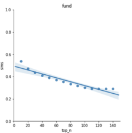
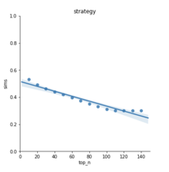
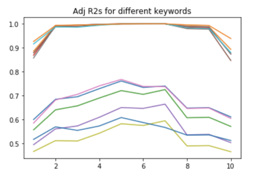
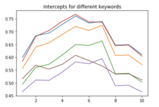
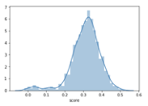
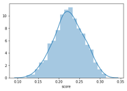
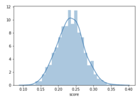

# Resume Rater
## Introduction

The objective of this project is to design a resume rater that should be able to "rate" an applicant based on the contents of the resume. Several approaches were considered, including both supervised and unsupervised approaches. Unsupervised approaches were chosen as part of this project instead of supervised ones due to difficulty in deciding how to rank resumes. The two approaches used were based on prior domain knowledge of how the resume process works. The approaches use keyword matching, with one a fixed keyword matching approach -- with `keywords` as initial parameters -- and the other a dynamic keyword matching approach, where no parameters nor hyperparameters are needed. Based on the results, we can see that very strong feature engineering is required, and that both are able to somehow rate resumes quite well. The fixed method is more robust, and is more in-line with how humans select resumes, while the dynamic method learns the underlying keywords from the entire dataset, with the assumption that the dataset `d` is generated by some hidden keywords `k` i.e. `P(D=d|K=k)` and we find `P(K=k|D=d)` that can be used to determine the matching keywords for each data sample. The dynamic method though suffers from high variance due to its use of Gibb's Sampling, which can be minimized by ensembling.

The project also has a information extraction component to it. There are both machine learning classification and rule-based prediction approaches that can be used. But due to the time required and high bias of labelling the datasets myself (if time permits)**, the latter approach is used. Before the rule-based approach was decided, a pre-trained general Named Entity Recognition (NER) model from SpaCy[2] was used to perform entity detection. However, it has very low recall (relevant info undetected). A rule-based approach has much better recall. However, it suffers from low precision (irrelevant info captured) in resumes that are sophisticatedly designed, and a few pre-processing techniques have to be applied before applying the algorithms.

** A labelled dataset of a few hundred samples is needed for a specific sector/country. For each dataset, name entities have to be labelled with pre-defined tags.  See [1] for how the entities are labelled

## Domain Knowledge
Before a resume is crafted, usually a job description will be posted, and then the applicant will (likely) tailor their resume to suit the job description. Depending on the size of the company, the HR will then filter the resume based on keywords that they expect to see, with keywords being either general to the company or provided by the recruitment evaluators (typically the project team). The resume lifecycle thus involves a tacit game between the candidate and the company, and the resume rater is modelled after this to-and-fro tacit interaction through reverse engineering.

The way HR filters resumes is also modelled. The modelling assumptions used are that (1) HR first matches the document based on keywords provided, and then (2) scans the document further to see whether the words are concise and not deviating much from each other. To account for experience range, it is assumed that HR does not look at how different a person's previous roles are from one another, but (3) how different a person's previous roles are to other resumes they have seen.

## Design
The first thing to do is determine the expected keywords that the human resume rater would expect to see (our ground truth), and then rate the resumes based on the expected keywords. There are two ways to determine keywords:
  1. by supplying them
  2. by learning (reverse-engineering) the keywords based on the documents themselves, with the assumption that the documents are generated based on those keywords

### Supervised Approach
For 1, we only need to supply the keywords and the rater rates based on the similarity of the document to the keywords.

### Unsupervised Approach
For 2, it is as though we are trying to figure out what the keywords the candidate expects the company to see are (for a given global space of keywords `K` and documents `D`, the candidate is trying to do `d' = argmax(d, k1..kn) P(D|K)`, where `d'` is the desired document, and `k1` to `kn` are keywords belonging to `K`).

We then use Latent Dirichlet Allocation (LDA), a generative model that assumes that each document `d` is a mixture of a small number of topics `z` and that each word in the document is attributed to one of the document's topics[3]. In simpler terms, it assumes `d` is generated by keywords from a mixture of topics `Z`.

It computes:
  1. `P(Z=z|D=d)`, the probability that document `d` is generated from topic `z`
  2. `P(K=k|Z=z)`, the probability that a word `k` is picked from topic `z`

We then find the keywords using the below formula:

&nbsp;&nbsp;&nbsp;&nbsp;&nbsp;&nbsp;&nbsp;&nbsp;&nbsp;&nbsp;&nbsp;&nbsp;&nbsp;&nbsp;&nbsp;&nbsp;&nbsp;&nbsp;&nbsp;&nbsp;&nbsp;&nbsp;&nbsp;&nbsp;&nbsp;&nbsp;&nbsp;&nbsp;&nbsp;&nbsp;&nbsp;&nbsp;&nbsp;&nbsp;&nbsp;&nbsp;&nbsp;&nbsp;&nbsp;&nbsp;&nbsp;&nbsp;&nbsp;&nbsp;&nbsp;&nbsp;&nbsp;&nbsp;&nbsp;&nbsp;&nbsp;

where `P(K=k|D=d)` is the probability that keyword `k` generates document `d`, and `nargmax` is the `argmax` for the top `n` keywords. Since `P(Z|D=d)` and `P(K|Z)` are provided by LDA, we can compute `P(K=k|D=d)` easily. All we need to do is select `n` to specify how many keywords we want for each document `d`.

### Rating Implementation
With keywords determined (supervised) or found (unsupervised), we then use matching strategies to match keywords to the document to fulfil (1) in `Domain Knowledge`, as well as matching words within the document to fulfil (2) in `Domain Knowledge`.

#### Two matching strategies:
1. Keyword Match (KM): Look for match in keywords (Familiarity of job)
  - For each keyword, get the mean of the n'th (for n = 10..100, factor of 10) largest correlation values of the keyword vector to the words in the document, and then plot the regression of the 8-degree** polynomial of the means and get the intercept
  - For the supervised strategy, since the keywords have no weights attached to them, we average the intercepts for each keyword to get the `KM` score
  - For the unsupervised strategy, since the probabiltiies of the keywords can be derived from the LDA model, we can use them as weight coefficients for each intercept in a linear combination to get the `KM` score

regression of mean of top `n` correlations for a particular keyword

for another keyword

2. Within Match (WM): Look for match within words matched by keywords (Conciseness of experience)
  - For each keyword, get the mean of the correlations between the n'th (for n = 10..100, factor of 10) largest correlated word vectors wr.t. the keyword vector less the keyword vector to itself (since corr=1), and then plot the regression of the 8-degree** polynomial of the means and get the intercept
  -  For the supervised strategy, since the keywords have no weights attached to them, we average the intercepts for each keyword to get the `WM` score
  - For the unsupervised strategy, since the probabiltiies of the keywords can be derived from the LDA model, we can use them as weight coefficients for each intercept in a linear combination to get the `WM` score

** Most intercepts plateau at 7-degree, where adjusted R2 is max. However, at 7-d, intercept ratio between keywords are very low, which means words similar to the keywords and not so similar are hard to differentiate. Also, there is a steep drop in intercept value from 7-d to 8-d. As 8-d difference is similar to 1-d, with much higher adj R2, we can get a more accurate keyword dissimilarity using 8-d.

Can see that most adj R2s plateau at 7-d

Steep drop of intercept from 7-d to 8-d

For the final rating score, we have `final_score = KM * WM` and then we take the `max`, `min`, and `sd` to compute the rating score using min-max normalization with max capped at `max-sd`. We do that because the scores are usually pretty normal and if not the bulk of the scores will barely pass.

For a fixed Keywords-trained model

For an LDA-trained model

Another LDA-trained model

### Potential Additional Rating Implementations
We can also model uniqueness (3 in `Domain Knowledge`) by using the topic distributions of each resume document and comparing the dissimilarity. However, due to its high instability, it is not incorporated into the model until proper function modelling is done.

##### Strategy:
Between Divergence (BD): Look for diversity amongst candidates (Uniqueness)
- For each candidate, get the topic probability distributions (default=20 for our LDA model)
- Compare the distribution with the distributions of other candidates using Jensen-Shannon divergence[4], a symmetric and finite version of the Kullback-Leibler divergence.
- We then get the mean of the JS divergences to get the `BD` score

A naive implementation of incorporating the `BD` score is by dividing the `BD` score with `KM*WM`, since `BD` is inversely proportional to uniqueness. However, that strategy distorts the important of `KM*WM`, making the ratings seem no different from random. Another strategy could be having it as a separate score or adding a function of `BD` to the score i.e. `final_score = KM*WM + f(BD)`. Due to the sophisticated of this feature, it is not incorporated into the model as of now.

#### Information Extraction Implementation
For information extraction, a rule-based prediction approach is used due to reasons mentioned in the `Introduction`. The rules-based approach does pretty well for standard resumes, but suffers from low precision on sophisticatedly-designed resumes (irrelevant info captured). False positives are minimized by first detecting category boxes (Like "Work Experience" and "Education") and then performing relevant extractions.

##### Problems faced
- For a good company and name detection algorithm, a Named Entity Recognition (NER) model has to be trained on a large dataset containing many different CVs well-labelled for it to generalize well.
- Since labelling takes a lot of time, and since there are no well pre-trained NER models out there, non-AI methods are used
- Some CVs have very complicated document formatting (very hard to parse)
- Some people have names that SpaCy's NER model has not learnt before, so it cannot detect his/her name
- Some CVs have company names that are very different from modern companies e.g. (Usaha Tegas Sdn Bhd), thus the NER model cannot detect it
- Some CVs have names and company names that are of different languages to what the NER model could detect
- Some CVs have their job duration in front of their job description instead of behind, which was initially not detected
- Sometimes the pdf parser parses a list dot as the letter o, which renders the detection algorithm not being able to detect that the line is a list item
- Using a non-AI approach, it's not possible to detect anything if the text converted is screwed up e.g. all the titles are all the way below the text
- For docx documents, list bullets cannot be extracted with `python-docx`, so for now a lot of irrelevant information will be shown until a custom docx parser is built

#### Sample of good extraction (high precision; with rating)
`src/data/test/Dong Xing_Catherine Zhang_Equity Research Intern.pdf`

    Name: ZHANG Xiaoyu Catherine
    Email: zhangxy923@126.com
    Number: +852 54871558
    City/Country: China

    Work Experience:
    6 years 4 months
    - Dongxing Securities Shenzhen, China
    - Equity Research Intern, Computer Team Jan 2017 - Now
    - AI and Internet+. Collect and analyze industry and firms’ information; get financial data by Wind and Bloomberg).
    - Roland Berger Strategy Consultants Shanghai, China
    - Part-time Assistant, Financial Services Department Sep 2016 - Nov 2016
    - Bank of China Beijing, China
    - Clients Manager, Individual Financial Department Sep 2012 - Jun 2016
    - PROJECT EXPERIENCE
    - ABT) Hong Kong
    - Team Leader Mar 2017 - Apr 2017

    Education:
    5 years 1 months
    - City University of Hong Kong Hong Kong
    - Master of Science in Financial Services Aug 2016 - Nov 2017
    - Investment, Derivatives and Risk Management, Corporate Finance, Financial Statement Analysis,
    - Fixed Income Securities, Credit Risk Management.
    - Capital University of Economics and Business Beijing, China
    - Bachelor of Science in Finance Sep 2008 - Jun 2012
    - RenMin Scholarship, 7 times (Top 10%).
    - Investment Banking, Securities Investment Fund, Financial Model Design, Accounting, Economic Law.
    - The University of Hong Kong Hong Kong
    - Exchange Student Jul 2011- Aug 2011
    - Financial Analysis, Marketing Management, Writing.

    Skills:
    Security, Finance, Writing, Analysis, Accounting, Research, Marketing, Email, Economics, Strategy, Excel, Powerpoint, Financial analysis, Presentation, Design, Technical, Cfa, Banking, Reports, Due diligence, Word, Mobile, Risk management, Analyze, Ai, Data analysis, Microsoft office, Modeling
    ----------
    Rating: 9

#### Sample of not-so-good extraction (low precision; with rating)
`src/data/test/Brawn Capital_Minori Yoshida_FM.docx`

    Name: Minori Yoshida Yan Wo Yuet Building
    Email: y.minori512@gmail.com
    Number: +852-9544-5637
    City/Country: Hong Kong

    Work Experience:
    6 years 4 months
    - Brawn Capital Limited, Central, Hong Kong
    - August 2016 Present
    - Finance Manager
    - Manage financials of project finance working closely with developer and asset management company in Japan
    - Establish and improve internal financial processes of both project and corporate
    - Manage budget, financial reports and tax flings both in Hong Kong and Japan
    - KPMG AZSA LLC, Tokyo, Japan February 2012 February 2015
    - Audit Practice
    - Perform annual financial audits, quarterly reviews under J-GAAP and internal control audit under J-SOX for audit engagements of various clients including one of the biggest Japanese public companies listed in Tokyo Stock Exchange
    - Perform reporting package reviews under IFRS and US-GAAP for various clients who have overseas parent companies
    - Consult on management accounting issues and deliver solutions.
    - Identify and communicate accounting and auditing matters to managers and partners

    Education:
    3 years 11 months
    - Meiji University Bachelor of Business Administration April 2007 March 2011
    - Department of Accounting

    Skills:
    Sales, Budget, Analysis, Auditing, Process, Tax, Administration, Reports, Gaap, Budgeting,
    Financial analysis, English, Reporting, Finance, Modeling, Accounting, Financial reports,
    Consulting, Journal entries, Flower, Communication, Audit, Word, Relationship management,
    Excel
    ----------
    Rating: 8

## Conclusion
In conclusion, for a general resume rater, such an approach could work well as a first-pass test. However, for a more robust rater that can achieve high true positives (ratings similar to what HR would give or translates to actually hiring good fits), a more supervised approach should be taken.

For information extraction, a Named Entity Recognition approach would work much better than a rule-base approach. However, the only challenge is knowing what labels to label and labelling the labels correctly, as well as getting a dataset suitable for the company. A big company with many employees would benefit very well with such an approach. However, for smaller companies, rule-based approach still works best given its high recall (ensuring relevant information is captured).

## Installation

Use Python3

    pip3 install -r requirements.txt
    python3 pre_requisites.py

Test run

    python3 main.py --type fixed "src/data/test/Dong Xing_Catherine Zhang_Equity Research Intern.pdf" --model_name model

## Usage
### For testing:
Test resumes can be found in `src/data/test`

#### Supervised (Fixed Keywords)
For the fixed keyword implementation, the pre-trained model is trained on the keywords:

`[fund, asset, investment, accounting, trust, strategy]`

To use it, type:

      python3 main.py path/to/resume

or, long-form,

      python3 main.py --type fixed path/to/resume

for specific model (no default):

      python3 main.py --type fixed path/to/resume --model_name model

or using model path (no default):

      python3 main.py --type fixed path/to/resume --model_path path/to/model

Resume should be `pdf` or `docx` format
Pre-trained model: `src/models/model_fixed/model.json`
Pre-trained model_name: `model`

#### Unsupervised (LDA-generated keywords)
To use the LDA-generated keyword implementation:

      python3 main.py --type lda path/to/resume

for specific model:

      python3 main.py --type lda path/to/resume --model_name model

or using model path (no default):

      python3 main.py --type lda path/to/resume --model_path path/to/model

Resume should be `pdf` or `docx` format
Pre-trained model: `src/models/model_lda/model.json`
Pre-trained model name: `model`

---
### For training:
Training resumes can be found in `src/data/train` (size=1468)

or for a smaller dataset (size=30), `src/data/sample_train`
#### Supervised (Fixed Keywords)
For the fixed keyword implementation:

      python3 main.py --train path/of/training_directory --type fixed --keywords fund asset investment accounting trust strategy --model_name abc_model

Model and keywords will be saved in `src/models/model_fixed`

#### Unsupervised (LDA-generated keywords)
For the LDA-generated keyword implementation:

      python3 main.py --train path/of/training_directory --type lda  --model_name abc_model

Model and LDA model will be saved in `src/models/model_lda`

## References
[1] https://github.com/DataTurks-Engg/Entity-Recognition-In-Resumes-SpaCy
[2] https://spacy.io/usage/linguistic-features#named-entities
[3] https://en.wikipedia.org/wiki/Latent_Dirichlet_allocation
[4] https://en.wikipedia.org/wiki/Jensen%E2%80%93Shannon_divergence
